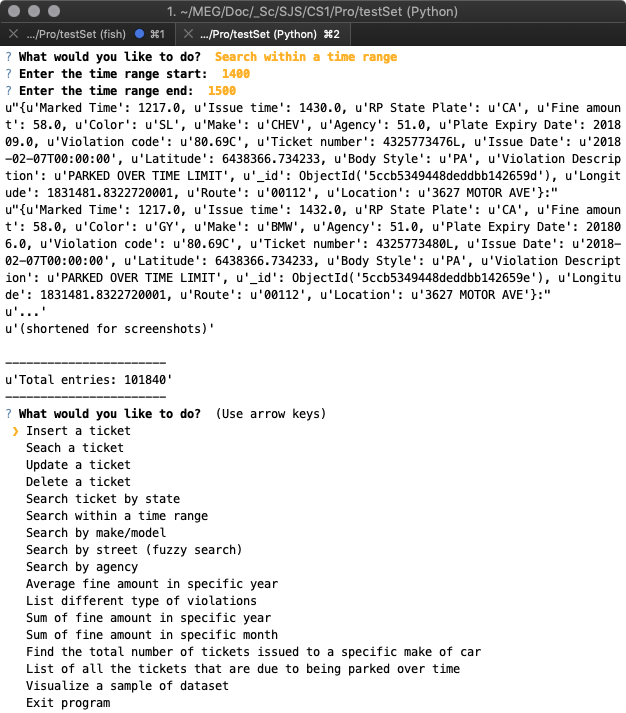

Los Angeles Parking Citations: Final Project Report

I.  **Application Description**

> Our application is based on the issuing of parking citations in the
> city of Los Angeles. It is a console-based database application with
> MongoDB running in a cluster on AWS. Users will be able to interact
> with the database by inserting, updating, and deleting documents
> through the console regarding information about parking citations. The
> Los Angeles Department of Transportation may use this application to
> gather specific data about locality where parking citations are issued
> and which rules are being violated in order to further enforce traffic
> laws.
>
> We are using NoSQL deployment versus a traditional relational database
> management system (RDBMS) because the data is unstructured. Our chosen
> data set, described later in the report, does not have a fixed
> schema--the fields may vary between documents, as some fields may
> exist in some and be non-existent in others. Traditional RDBMSs would
> store all of the non-existent field values as NULL, resulting in a
> table that is very wide that wastes space. MongoDB gives us more
> flexibility by allowing us to store this varying data such that each
> document can have different field-value pairs.

I.  **Project Successes**

> One beneficial choice was choosing Pymongo and Python as a programing
> language, as Python is easy to get running, has a very robust package
> manager, many libraries to choose from, and was very easy to use and
> implement for our application.
>
> Our team was also very proactive about getting the project done and
> was a pleasure to work with despite the end of the semester and other
> projects being due.

I.  **Unexpected Events**

> While Python is an easy language to pick up, some of our team never
> used it and needed to get familiar with the environment, best
> practices, and syntax through tutorials and Google searches.
>
> Wrangling the data set into JSON format for bulk insert into MongoDB
> proved to be challenging given the size of the dataset. Our team
> looked for the most efficient way to do so while tackling different
> avenue. In the end, splitting the data into smaller sections and
> wrangling it one by one was the easiest method.

I.  **Lesson Learned**

> Python is a great language and has a great ecosystem, but setting up
> that environment can sometimes prove to be challenging due to
> incompatibility with different Python versions, default Python version
> installed on our operating systems, and different plugins.
> Additionally, due to the above portability of a script or app, it can
> be challenging to bundle together as a package. Nothing to be done for
> that except maybe switching languages, however, they all have their
> pros and cons.

I.  **Dataset**

> *URL*:
> [*https://www.kaggle.com/cityofLA/los-angeles-parking-citations\#parking-citations.csv*](https://www.kaggle.com/cityofLA/los-angeles-parking-citations#parking-citations.csv)
>
> We are using a public data set for Los Angeles Parking Citations
> hosted by the city of Los Angeles from Kaggle. This data set contains
> information about parking citations in Los Angeles, including
> information about the ticket number, time and date of its issuing, car
> information (excluding license plate number), violation description
> and fine, and location in latitude and longitude of the citation
> issuing.
>
> *Data Wrangling*: The data set is given in a .csv file which is 1.21
> GB. To wrangle this data for importing and querying in MongoDB, we
> first had to convert the .csv file to .json format. We were able to
> accomplish this by reading the .csv file in a Python Pandas DataFrame,
> dropping the null values for each row, converting each row to JSON,
> and uploading the .json file to AWS.
>
> *Data Wrangling Code:\
> *import pandas as pd\
> x=pd.read\_csv('/Users/shreya90/Desktop/parking-citations.csv')\
> import json\
> for index,row in x.iterrows():\
> row=row.dropna()\
> jd= row.to\_json()\
> with open('data.json', 'a') as f:\
> f.write(jd+'\\n')

I.  **Schema Description**

Our database in MongoDB is vparkdb and our collection is vpark. We
decided to create an index on the “Ticket number” field to optimize
queries involving ticket numbers and finding specific ranges of ticket
numbers.

  ----------------------- ------------ ------------------------------------------------------------------------------------------
  Field name              Field type   Field description
  Ticket number           Integer      A unique identifier for the citation issued
  Issue Date              String       Date that the ticket was issued
  Issue time              Integer      Time that the ticket was issued (on a 24-hour clock)
  Meter Id                String       The ID of meter where the ticket was issued
  Marked Time             Double       N/A
  RP State Plate          String       State of the license plate that the ticket was issued to
  Plate Expiry Date       Timestamp    Date that the license plate expires
  Make                    String       Make of the car that the ticket was issued to (example: TOYT for Toyota, HOND for Honda)
  Body Style              String       Abbreviation for body style of car ticketed
  Color                   String       Color of the car the ticket was issued to
  Location                String       Street that the ticket was issued
  Route                   String       Route that the ticket was issued
  Agency                  Integer      Agency ticket was issued by
  Violation code          String       Code corresponding to specific law violation issued by the city of Los Angeles
  Violation description   String       Description of the ticket violation
  Fine amount             Double       Amount in USD of the ticket
  Latitude                Double       Latitude (in ft.) of location ticket was issued
  Longitude               Double       Longitude (in ft.) of location ticket was issued
  ----------------------- ------------ ------------------------------------------------------------------------------------------

I.  **NoSQL Configuration**

*Setting up the cluster in AWS:*

**Directory for config-servers:**

sudo mkdir -p /db/skconfig/data (in all three nodes)

**Starting for configservers:**

sudo mongod --port 27022 --dbpath /db/skconfig/data --configsvr
--replSet skconfig --bind\_ip 172.31.18.13

sudo mongod --port 27022 --dbpath /db/skconfig/data --configsvr
--replSet skconfig --bind\_ip 172.31.23.91

sudo mongod --port 27022 --dbpath /db/skconfig/data --configsvr
--replSet skconfig --bind\_ip 172.31.31.175

**Logging to Mongod config server in primary: **

sudo mongo --host 172.31.18.13 --port 27022

**Adding configerver in a replica set (skconfig):**

rs.initiate(

{

\_id: "skconfig",

configsvr: true,

members: \[

{ \_id : 0, host : "172.31.18.13:27022" },

{ \_id : 1, host : "172.31.23.91:27022" },

{ \_id : 2, host : "172.31.31.175:27022" }

\]

}

)

**To connect mongos to all the three configuration servers:**

sudo mongos --configdb
skconfig/172.31.18.13:27022,172.31.23.91:27022,172.31.31.175:27022
--port 27021 --bind\_ip 172.31.18.13

**Starting Shard servers:**

sudo mongod --port 27023 --dbpath /db/shard0/data --shardsvr --replSet
skdata --bind\_ip 172.31.18.13

sudo mongod --port 27023 --dbpath /db/shard1/data --shardsvr --replSet
skdata --bind\_ip 172.31.23.91

sudo mongod --port 27023 --dbpath /db/shard2/data --shardsvr --replSet
skdata --bind\_ip 172.31.31.175

**Logging to shard server in primary :**

sudo mongo --host 172.31.18.13 --port 27023

**Adding shard server in a replica set:**

rs.initiate(

{

\_id: "skdata",

members: \[

{ \_id : 0, host : "172.31.18.13:27023" },

{ \_id : 1, host : "172.31.23.91:27023" },

{ \_id : 2, host : "172.31.31.175:27023" }

\]

}

)

{width="6.5in" height="3.571527777777778in"}

**Logging to Mongos in primary** :

sudo mongo --host 172.31.18.13 --port 27021

**Setting chunksize to 1 mb for better distribution:**

db.settings.save( { \_id:"chunksize", value: 1 } )

**Adding Shards in mongos**

sh.addShard( "skdata/172.31.18.13:27023")

sh.addShard( "skdata/172.31.23.91:27023")

sh.addShard( "skdata/172.31.31.175:27023")

**Enabling sharding on database:**

sh.enableSharding("vparkdb")

**Enable shard-key in mongos:**

sh.shardCollection("vparkdb.vpark", { "Violation code" : 1 })

{width="6.5in" height="3.579861111111111in"}

**sh.status() after enabling sharding but before performing mongoimport:
**

{width="6.5in" height="6.629861111111111in"}

**Uploading JSON data from local machine to AWS instance:**

pscp -i C:\\Users\\amdut\\.ssh\\my-key-pair.ppk
D:\\amdut\\Downloads-to\\data2\\data2.json
[*ubuntu@ec2-52-53-221-67.us-west-1.compute.amazonaws.com:/home/ubuntu/data2.json*](about:blank)

pscp -i C:\\Users\\amdut\\.ssh\\my-key-pair.ppk
D:\\amdut\\Downloads-to\\data2\\data3.json
[*ubuntu@ec2-52-53-221-67.us-west-1.compute.amazonaws.com:/home/ubuntu/data3.json*](about:blank)

{width="6.5in" height="1.6888888888888889in"}

**Mongo Import of files to collection=vpark db=vparkdb:**

{width="6.5in" height="5.004861111111111in"}

**Displaying the 1.05 GB data in our collection after importing data:**

{width="6.5in" height="6.16875in"}

[]{#_gjdgxs .anchor}**sh.status(true) for chunk distribution output
after importing data:**

{width="6.5in" height="4.839583333333334in"}

**Security rules for enabling pymongo from local machine to connect to
AWS:**

**Local public IP: 71.202.20.112**

{width="6.5in" height="2.8833333333333333in"}

**Example on VM2:**

{width="6.5in" height="2.9451388888888888in"}

1\) Testing an end-to-end connection from application to MongoDB:

**Installing pymongo and testing end-to-end connection from local VM:**

{width="6.5in" height="2.839583333333333in"}

{width="6.5in" height="2.654861111111111in"}

2\) Application reads data from the database by executing one of the
functions:

**Testing with find\_one() from Pymongo client:**

from pymongo import MongoClient

from pprint import pprint

client =
MongoClient('mongodb://[*ec2-52-53-221-67.us-west-1.compute.amazonaws.com:27023/*](http://ec2-52-53-221-67.us-west-1.compute.amazonaws.com:27023/)')

ec2-52-53-221-67.us-west-1.compute.amazonaws.com:27023 -&gt;Public DNS
for AWS Mongodb instance (Shard server)primary.

{width="6.5in" height="3.9819444444444443in"}

**Checking incoming-pymongo connection on AWS Mongodb instance (Shard
server) Primary:**

{width="6.5in" height="3.5277777777777777in"}

I.  **NoSQL Driver and End-to-End Description From Application to
    Database**

> Our high-level language of choice is Python, with PyMongo as the
> driver to connect and manipulate data in our MongoDB database. We used
> PyInquirer, a Python module for command line user interfaces, to
> format the interactive questions for our application.
>
> Connecting to the database from Python through PyMongo is very simple,
> it first needs to be installed through the Python package manager then
> imported into the script file. It is then as simple as doing the
> following to connect to the database:
>
> {width="6.5in" height="1.0694444444444444in"}
>
> An example of querying the database using PyInquirer is as follows:
>
> {width="6.5in" height="3.1666666666666665in"}
>
> From there, the PyMongo will return collection that be easily used to
> retrieve data from. The results of these queries are shown in the
> functions in the following section.

I.  **15 Functions**

> This section details 15 use cases for our application that the user
> can perform. For each function we have written a corresponding MongoDB
> query, executed the function through out application, and provided a
> screenshot to show the results. We limited the outputted document
> results to 3 for the purpose of screenshotting. To perform these
> functions, the user can access the User Menu in the console by first
> running the application:
>
> {width="6.5in" height="4.402777777777778in"}

1.  **Inserting a ticket**\
    → Insert ticket number 500000\
    \
    ticket\_data = {\
    "Ticket number": 500000,\
    "Issue Date": '2018-02-05T00:00:00',\
    "Issue time": 1216.0,\
    "RP State Plate": ‘CA’,\
    "Plate Expiry Date": 201807.0,\
    "Make": ‘NISS’,\
    "Body Style": ‘PA’,\
    "Color": ‘BK’,\
    "Location": ‘750 SPAULDING AVE S’,\
    "Route": 00144.0,\
    "Agency": 51.0,\
    "Violation code": ‘80.39BS’,\
    "Violation Description": ‘NO PARK/STREET CLEAN’,\
    "Fine amount": 73.0,\
    "Latitude": 6453238.3586370004,\
    "Longitude": 844996.969673\
    }\
    db.tickets.insertOne(ticket\_data)\
    \
    {width="6.5in" height="8.11111111111111in"}

2.  **Finding a ticket**\
    → Find ticket number 4325781762\
    \
    db.tickets.find({"Ticket number": 4325781762})\
    \
    {width="6.5in" height="5.819444444444445in"}

3.  **Updating a ticket**\
    → Update ticket number 4325781762\
    \
    updateFilter = {'Ticket number': 4325781762))}\
    \
    ticket\_data = {\
    "Ticket number": 4325781762,\
    "Issue Date": '2018-02-05T00:00:00',\
    "Issue time": 1216.0,\
    "RP State Plate": ‘CA’,\
    "Plate Expiry Date": 201807.0,\
    "Make": ‘NISS’,\
    "Body Style": ‘PA’,\
    "Color": ‘BK’,\
    "Location": ‘750 SPAULDING AVE S’,\
    "Route": 00144.0,\
    "Agency": 51.0,\
    "Violation code": ‘80.39BS’,\
    "Violation Description": ‘NO PARK/STREET CLEAN’,\
    "Fine amount": 73.0,\
    "Latitude": 6453238.3586370004,\
    "Longitude": 844996.969673\
    }\
    \
    db.tickets.update\_one(updateFilter, { \$set : ticket\_data})

> {width="6.5in" height="7.75in"}

1.  **Deleting a ticket**\
    → Delete ticket number 4325781762\
    \
    db.tickets.deleteOne({“Ticket Number” : 4325781762})\
    \
    {width="6.5in" height="4.930555555555555in"}

2.  **List of all the tickets with a certain state plate**

> → Find all tickets where the car has a Nevada state plate
>
> db.tickets.find({"RP State Plate": "NV"})
>
> {width="6.5in" height="7.222222222222222in"}

1.  **List of all the tickets during a given time range**

> → Find all tickets that were issued between 2:00PM and 3:00PM (14:00
> and 15:00 military time)
>
> db.tickets.find({"Issue time": {\$gte: 1400, \$lte: 1500} })
>
> {width="6.5in" height="7.402777777777778in"}

1.  **List of all the tickets with a specific make of car**

> → Find all tickets issued to BMWs
>
> db.tickets.find({"Make" : "BMW"})
>
> {width="6.5in" height="7.222222222222222in"}

1.  **List of all the tickets on a certain street**

> → Find all tickets issued on Cloverdale St.
>
> (Note: fuzzy search means that it will search for the street name
> anywhere in the value of the street address in the document)
>
> db.tickets.find({"Location": {\$regex : ".\*CLOVERDALE.\*"} })
>
> {width="6.5in" height="7.222222222222222in"}

1.  **List of all the tickets of a specific agency**

> → Find all tickets issued by the DOT Hollywood Agency, specified by
> code 54
>
> (Note: The data set URL contains a table of Agency name to Agency
> code)
>
> db.tickets.find({"Agency" : 54})
>
> {width="6.5in" height="7.222222222222222in"}

1.  **Find the average fine amount in a certain year**

> → Find the average amount of fines from tickets issued in 2018
>
> db.tickets.aggregate(
>
> { \$match: { "Issue Date": {\$regex : "2018-.\*"} }},
>
> { \$group: { \_id: null, avgFine: {\$avg: "\$Fine amount" } } }
>
> )

{width="6.5in" height="4.930555555555555in"}

1.  **List the different types of violations (violation code)**

> db.tickets.distinct("Violation code")

{width="6.5in" height="5.291666666666667in"}

1.  **Find the sum of the fines accumulated from a certain year**

> → Find the sum of the fines accumulated from the year 2019
>
> db.tickets.aggregate(
>
> { \$match: { "Issue Date": {\$regex : "2019.\*"} }},
>
> { \$group: { \_id: null, fineSum: {\$sum: "\$Fine amount" } } }
>
> )
>
> {width="6.5in" height="4.930555555555555in"}

1.  **Find the sum of fines issued from tickets from a certain month**

> → Find the sum of fines from tickets issued in May
>
> db.tickets.aggregate(
>
> { \$match: { "Issue Date": {\$regex : ".\*-05.\*"} }},
>
> { \$group: { \_id: null, fineSum: {\$sum: "\$Fine amount" } } }
>
> )
>
> {width="6.5in" height="4.930555555555555in"}

1.  **Find the total number of tickets issued to a specific make of
    car**

> → Find the total number of tickets issued to Honda cars
>
> db.tickets.aggregate(
>
> { \$match: { "Make": "HOND" }},
>
> { \$group: { \_id: "Make", ticketCount: {\$sum: 1 } } }
>
> )
>
> {width="6.5in" height="4.930555555555555in"}

1.  **List of all the tickets that are due to being parked over time.**

> db.tickets.find({"Violation Description" : "PARKED OVER TIME LIMIT"})
>
> {width="6.5in" height="7.222222222222222in"}
>
> **Visualize a sample of dataset and exiting the application:**
>
> {width="6.5in" height="4.402777777777778in"}

Aggregate query run from Mongo-shell on AWS to get sharding information:

{width="6.5in" height="2.263888888888889in"}

{width="6.5in" height="7.847222222222222in"}
